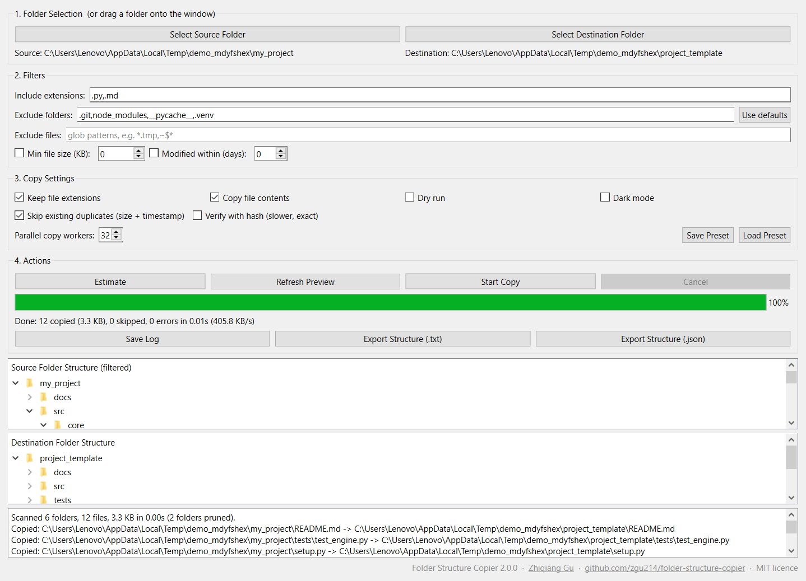

# Folder Structure Copier

A PyQt6 desktop application for copying a directory tree with selected file types. Copy full file contents or create empty placeholders with the same names; preview the structure and run a dry run before creating files.

Maintained by **Zhiqiang Gu · zhiqiang.gu214@gmail.com**. Independent personal project, unrelated to my employer or my work for any company.

## Screenshot



## Features

- Source and destination folder selection with tree previews.
- Comma-separated extension filters, for example `.py,.txt`.
- Copy contents or create zero-byte placeholder files.
- Keep or remove filename extensions.
- Dry-run logging, progress display and saved logs.
- Text/JSON structure export, saved presets and optional dark mode.

## Install and run from source

```shell
git clone https://github.com/zgu214/folder-structure-copier.git
cd folder-structure-copier
python -m venv .venv
```

Activate the environment:

```powershell
# Windows PowerShell
.venv\Scripts\Activate.ps1
```

```shell
# macOS/Linux
source .venv/bin/activate
```

Then install the GUI dependency and launch:

```shell
python -m pip install PyQt6
python folder_structure_gui.py
```

A graphical desktop and a Python version supported by the installed PyQt6 release are required. The repository also contains a Windows executable at [dist/folder_structure_gui_v5.exe](dist/folder_structure_gui_v5.exe); the source instructions above run the current Python file, which may differ from that packaged build.

## Example: create a project template

1. Select the original project as **Source Folder**.
2. Select a new, empty folder outside the source tree as **Destination Folder**.
3. Enter `.py,.txt` to include those file types, or leave the filter empty to include all files.
4. Enable **Keep file extensions**. Leave **Copy file contents** unchecked to create empty placeholders.
5. Enable **Dry Run**, then select **Start Copy Anyway**. Review the log.
6. Disable **Dry Run** and start again when the planned paths are correct.

To copy actual file contents, enable **Copy file contents**. Use **Preview Filtered Now** to inspect the extension-filtered tree; use **Save Preset** to reuse settings.

## Important behavior

- Existing destination files can be overwritten. Placeholder mode opens files for writing and can truncate an existing file. Use an empty destination for a new template.
- Keep the destination outside the source directory to avoid recursively copying newly created output.
- Removing extensions can cause collisions, such as `report.txt` and `report.csv` both becoming `report`.
- Extension matching uses the filename suffix as entered and is case-sensitive; `.txt` does not select `.TXT`.
- The filter applies to files; traversed folders may still be created even when no contained file matches.
- Dry run simulates planned paths; it does not prove that a later write will succeed or preserve data.

## Repository layout

- `folder_structure_gui.py`: application source.
- `screenshots/main_gui.png`: interface screenshot.
- `preset.json`: example saved settings; inspect paths before loading.
- `dist/`: existing Windows build and configuration.

## Feedback and license

Report problems with your operating system, Python/PyQt6 versions, selected options and a small reproducible example. Do not include confidential folder names or file contents.

Licensed under the [MIT License](LICENSE). PyQt6 and other dependencies retain their own licenses.

[LinkedIn](https://www.linkedin.com/in/zhiqiang-gu-55813318/) · [Email](mailto:zhiqiang.gu214@gmail.com)
